# Waydroid for Wolf — Android 13 streamed through Moonlight

A [games-on-whales/gow](https://github.com/games-on-whales/gow) app that boots a
full Android system inside a container and streams the whole Android desktop —
or a single Android game — to any Moonlight client through
[Wolf](https://github.com/games-on-whales/wolf).

* **Android:** LineageOS 20 VANILLA, `ro.build.version.release=13`,
  `ro.build.version.sdk=33`
* **ARM translation:** Google `libndk_translation` 0.2.3 by default; Intel
  Houdini as an opt-in alternative (see `WAYDROID_ARM_TRANSLATOR`)
* **Rendering:** Waydroid composites its own Wayland surface; Wolf captures it
  directly, with no nested compositor

This repository holds the app definition plus the engineering notes from getting
it working on a multi-GPU AMD host. Upstream `gow` does not ship a Waydroid app,
so there is no upstream version to diff against — this tree *is* the app.

---

## Status

**Working**

* Android desktop renders, with audio, on a single-GPU and on a multi-GPU AMD host
* Honor of Kings (`com.tencent.tmgp.sgame`): login, lobby, single-player and
  online (anti-cheat) matches, 30+ minutes of continuous play without a crash
* Per-session audio isolation when two clients stream at once
* Other tested titles: Genshin Impact, Delta Force, PUBG Mobile, Naraka,
  Dota Underlords, Exness/MetaTrader

**Known limitations** — see [Known limitations](#known-limitations)

---

## Screenshots

### Android desktop

LineageOS 20 rendering straight into Wolf's virtual compositor, captured from the
Moonlight stream.

| | |
| --- | --- |
| 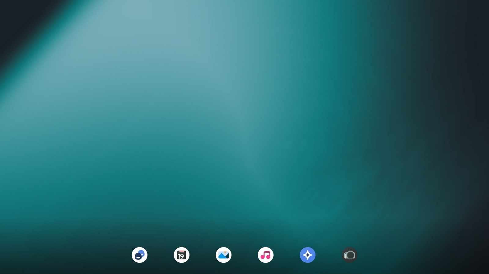 | 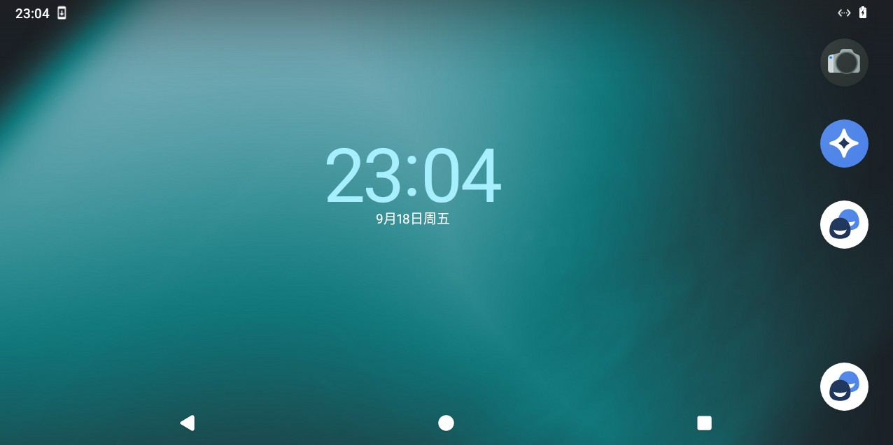 |

### Honor of Kings

Honor of Kings (王者荣耀) is the title that drove most of the work recorded in
`docs/` — the periodic in-match crash and the per-session audio fix were both
found chasing this game.

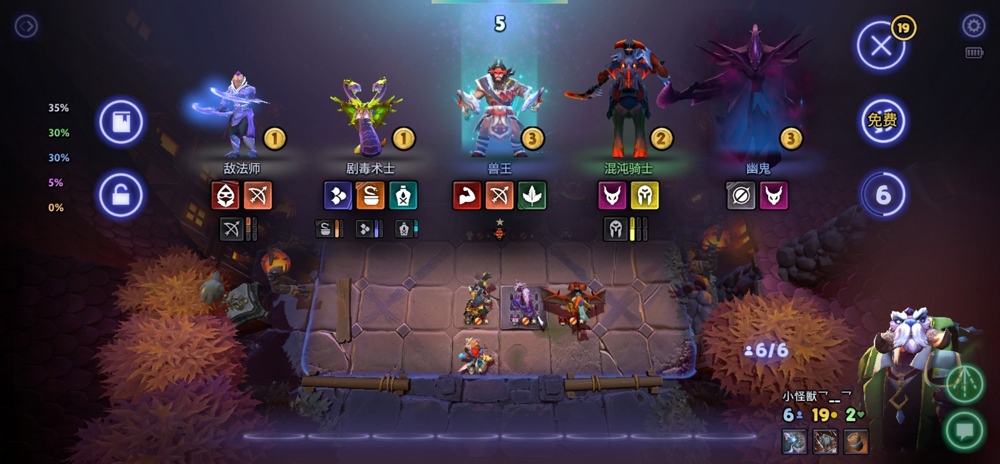

| | |
| --- | --- |
|  | 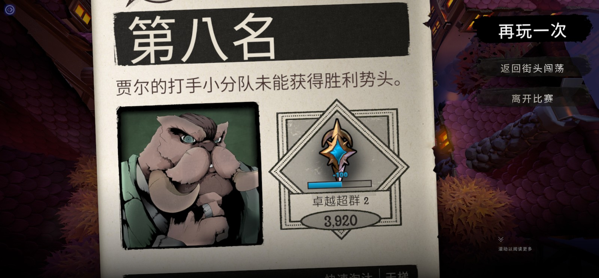 |

### Dialogs worth recognising

Real states this image produces. Knowing them saves chasing the wrong thing —
all four are explained in `docs/`.

| | |
| --- | --- |
| 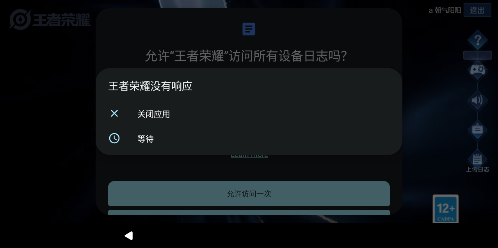 | 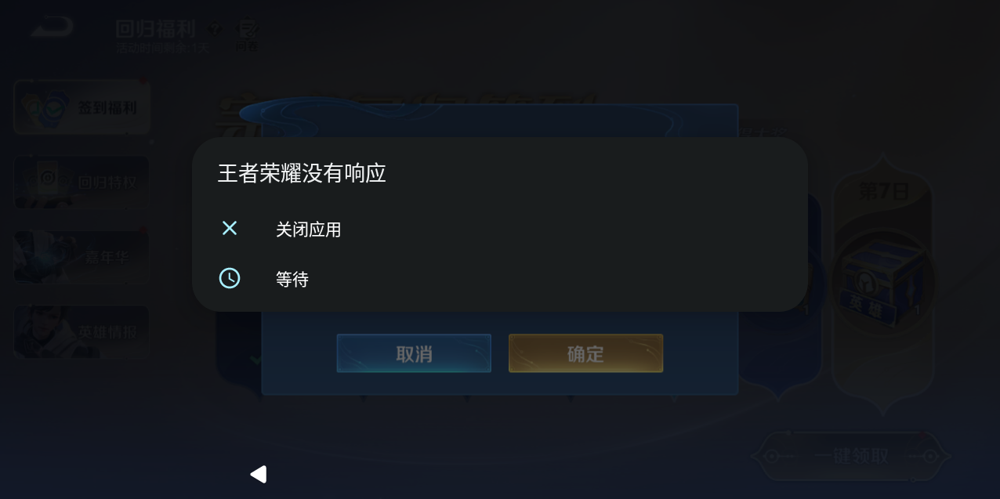 |

<details>
<summary><b>The remaining 14 screenshots</b> (desktop variants, more launch screens, the other two dialogs)</summary>

**Android desktop, other states**

| | | |
| --- | --- | --- |
| 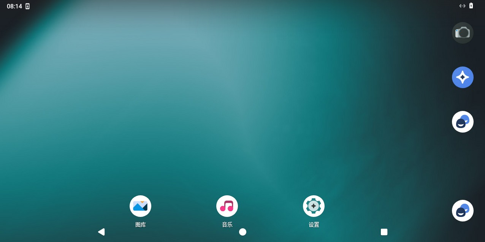 | 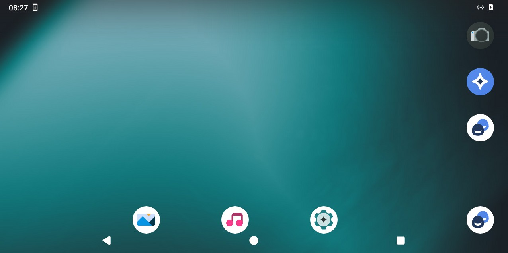 | 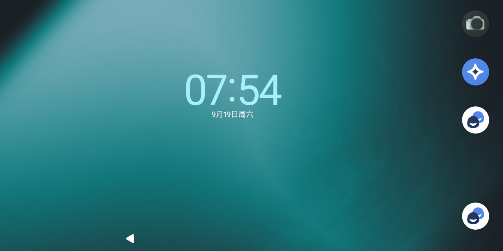 |

**Honor of Kings — splash and launch screens**

| | |
| --- | --- |
|  | 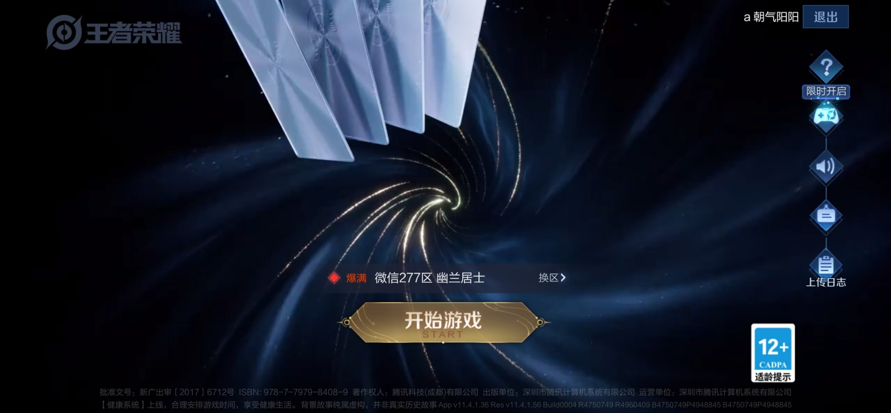 |
|  |  |
|  |  |
|  |  |
| 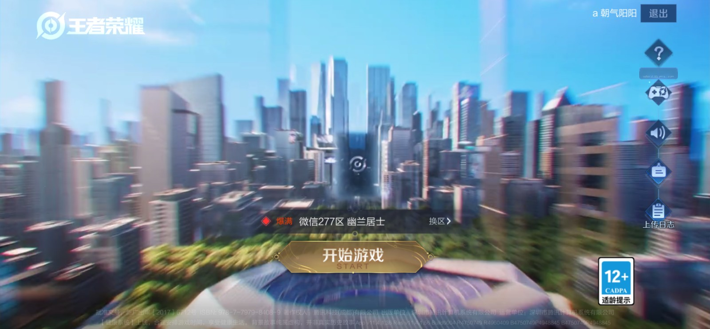 | |

**Other dialogs**

| | |
| --- | --- |
| 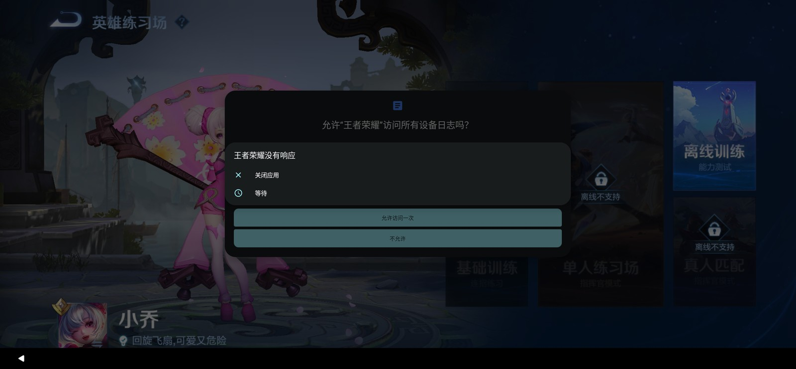 | 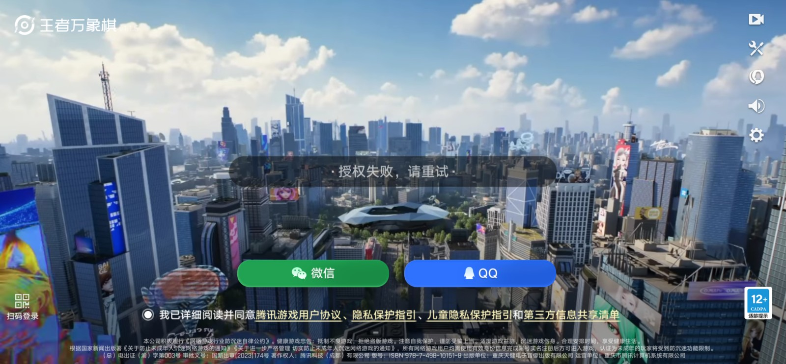 |

</details>

---

## Repository layout

```
apps/waydroid/
├── _index.md                 the app's documentation (Android side, privileges, troubleshooting)
├── build/                    the image that is actually built and used
│   ├── Dockerfile
│   ├── overlay/              files copied into the image filesystem
│   │   └── etc/cont-init.d/20-waydroid-setup.sh    <- most of the fixes live here
│   ├── scripts/              startup.sh, oomguard, anrwait, apprestore, waydroid-ui, ...
│   ├── assets/wolf.config.toml                     <- Wolf app template
│   ├── houdini/fetch-houdini.sh                    <- downloads the optional translator
│   └── libndk-*/             notes and patch scripts from failed experiments (no binaries)
├── build-fedora/             Fedora variant of the same layout
└── tests/                    smoke and integration tests

docs/
├── CHANGES.md                consolidated change list: every file, why, how to roll back
├── android-16-switch.md      historical: the earlier Android 16 attempt
├── android13-switch.md       why Android 13, and what changed to get there
├── android13-translator-analysis.md, berberis-comparison.md
├── waydroid-hok-*.md         Honor of Kings crash investigation, round by round
├── waydroid-audio-isolation-fix.md
├── wolf-debug-method.md      how to drive Wolf for headless debugging
└── screenshots/              21 screenshots (see above)

tools/
├── verify-image.sh           post-build check for every fix that once regressed
└── make-upstream-patch.sh    generates a patch adding this app to upstream gow

CONTRIBUTING.md               gow app conventions, and how to submit this upstream
```

Note that the screenshots live in `docs/`, not in `apps/waydroid/assets/`: the
upstream convention is that an app's `assets/` holds exactly one `screenshot.png`
for its docs page, so keeping the gallery out of the app directory keeps the
upstream patch lean.

---

## Requirements

* A Linux host with Docker and the **BuildKit** builder
  (`docker-buildx-plugin`). The Dockerfile uses `RUN <<EOF` heredocs; the legacy
  builder **silently skips them** and produces an image with no
  `/usr/bin/waydroid`, which then exits 127. This is not a hypothetical — it
  happened during development.
* A GPU with working DRM render nodes. Multi-GPU hosts are supported and pinned
  to one GPU (see `WAYDROID_MULTI_GPU`).
* Kernel support for binder/ashmem (the container creates the nodes itself).
* Host state directory, conventionally `/data/waydroid`, mounted at
  `/var/lib/waydroid`. It holds the Android images, userdata and overlay.

The container needs more privilege than any other gow app:

| Capability | Why |
| --- | --- |
| `SYS_ADMIN` | mount binderfs and let LXC create the nested Android container |
| `NET_ADMIN` | create the `waydroid0` bridge, enable `ip_forward`, install NAT rules |
| `MKNOD` | create binder/ashmem device nodes inside devtmpfs |
| `SYS_NICE` | audio HAL real-time priority |
| `NET_RAW` | the Android network stack's requirements |

---

## Build

```bash
cd apps/waydroid/build

# optional: the Houdini escape hatch (see WAYDROID_ARM_TRANSLATOR).
# Not committed, because it is Intel proprietary code.
./houdini/fetch-houdini.sh

docker build --build-arg BASE_APP_IMAGE=ghcr.io/games-on-whales/base-app:edge \
  -t gow-waydroid:latest .
```

The image builds fine without the Houdini archive; the escape hatch is then
unavailable and init section 4j logs a warning saying so.

## Verify the build

```bash
./tools/verify-image.sh gow-waydroid:latest
```

Checks that the image carries every piece each fix depends on — the waydroid
binary, the entrypoints, and the init sections for GPU pinning, audio HAL
shadowing, per-session hostname, hwcomposer's Wayland display, Mesa driver
selection and the translator switch. Exit codes: `0` pass, `1` fail, `2` image
not inspectable.

A red line here means a specific symptom is about to come back; the check names
say which. The static checks cannot prove the app *runs*, which needs a GPU host
and a Moonlight client.

## Install into Wolf

Copy `apps/waydroid/assets/wolf.config.toml` into Wolf's config, or merge its
`[[apps]]` block into an existing profile, then set the mount and image:

```toml
[apps.runner]
type = "docker"
name = "WolfWaydroid"
image = "gow-waydroid:latest"

env = [
  "RUN_SWAY=false",
  "WAYDROID_IMAGE_TYPE=VANILLA",
  "GOW_REQUIRED_DEVICES=/dev/input/event* /dev/dri/*",
  # optional, see the table below:
  # "WAYDROID_ARM_TRANSLATOR=libhoudini",
]

mounts = [
  { type = "bind", source = "/data/waydroid", destination = "/var/lib/waydroid" },
]
```

`RUN_SWAY=false` matters: Waydroid brings its own compositor and renders straight
into the Wayland display Wolf provides. A nested sway only adds a copy of every
frame, and when the UI exits its wrapper runs `killall sway`, taking the session
with it.

**Wolf caches app definitions at startup.** After editing `config.toml` run
`docker restart wolf`. Changes inside the image need no restart — Wolf creates a
fresh container per session, so reconnecting is enough.

---

## Environment variables

Everything is optional; the defaults are what the image is tuned for.

| Variable | Default | Purpose |
| --- | --- | --- |
| `RUN_SWAY` | `false` | `true` only to debug; see above |
| `WAYDROID_IMAGE_TYPE` | — | `VANILLA` for the plain image |
| `WAYDROID_ARM_TRANSLATOR` | `libndk` | `libhoudini` switches the ARM translator — the fix for anti-cheat ARM games that crash periodically |
| `WAYDROID_GUEST_HOSTNAME` | container hostname | Overrides the guest's UTS hostname, which Wolf's pulse router uses to attribute audio streams to a session |
| `WAYDROID_MULTI_GPU` | auto | GPU selection on multi-GPU hosts |
| `WAYDROID_DRM_DEVICE`, `WAYDROID_GRALLOC_DEVICE`, `WAYDROID_DRI_PRIME` | derived | Override the pinned GPU / render node |
| `WAYDROID_MESA_OVERRIDE`, `WAYDROID_MESA_EXTRA_ENV` | `radeonsi` | Mesa driver selection and extra env for the guest |
| `WAYDROID_HWC_WAYLAND`, `WAYDROID_HWC_XDG_RUNTIME_DIR`, `WAYDROID_HWC_WAYLAND_DISPLAY` | derived | hwcomposer's Wayland connection |
| `WAYDROID_BERBERIS_IMAGE`, `WAYDROID_BERBERIS_MODE`, `WAYDROID_BERBERIS_FLAGS` | auto | Only relevant on Android 16/17, which use the berberis translator; ignored on 13 |
| `WAYDROID_OOM_GUARD`, `WAYDROID_OOM_PROTECT`, `WAYDROID_ALLOC_MAX_MB`, `WAYDROID_GAME_CPUS` | on / game packages | Periodic guard that keeps lmkd from killing the game instead of the leaking graphics allocator |
| `WAYDROID_ANR_AUTOWAIT`, `WAYDROID_ANR_POLL` | on / 1s | Auto-dismiss ANR dialogs during the game's very heavy startup |
| `WAYDROID_LOGACCESS_AUTOTAP` | `0` | Auto-dismiss the log-access dialog. **Off deliberately** — that dialog is a symptom of the game crashing, not a cause |
| `WAYDROID_APP_RESTORE`, `WAYDROID_APP_PACKAGE`, `WAYDROID_INIT_ON_START` | — | App staging/restore helpers |
| `WAYDROID_ALLOW_DEBUGGABLE`, `WAYDROID_SKIP_INIT`, `WAYDROID_SKIP_NETWORK_FIX` | — | Development escape hatches |

---

## Notable fixes

Symptoms that took real digging; each is documented in the script next to the
code that fixes it, and in [`docs/CHANGES.md`](docs/CHANGES.md) with its rollback.

| Symptom | Cause | Fix |
| --- | --- | --- |
| Black screen | hwcomposer could not open a Wayland display | init §4i-ter gives the guest a usable `/run/xdg` + `wayland-N` |
| 花屏 (corrupted image) | `drm_device` and `gralloc.gbm.device` pointed at different GPUs, causing a cross-GPU hand-off | §4g derives both from one source and forces them to agree |
| No audio anywhere in the system | the HAL loader resolved a 9800-byte stub instead of the real HAL, because `ro.hardware.audio.primary` is unset | §4f-bis shadows the real HAL over the `default` name |
| Container exits 127 | built with the legacy Docker builder, which skips the heredocs and leaves out `/usr/bin/waydroid` | build with BuildKit |
| Online mode crashes instantly | the overlay mount failed, Waydroid disabled overlays, and the AArch64 anti-cheat library could not be loaded | `index=off` in `mount_overlay()` — see the caveat in `docs/CHANGES.md` |
| Game crashes every ~4 minutes | anti-cheat memory scanning corrupting framework heap under `libndk_translation`; seven tombstones, all in `libinput`'s `InputConsumer` at offset +0 | `WAYDROID_ARM_TRANSLATOR=libhoudini` |
| Two devices' audio crossed / one silent | Wolf's pulse router keys its session map by container hostname, but Waydroid hardcodes every guest's hostname to `waydroid`, so 0 of 31 routing attempts ever matched | init §4d-bis sets the guest hostname per container |
| ANR dialogs stack up | the auto-wait helper used `$LXC` for a variable named `_LXC`, so every command silently failed | use the right variable, and tap the dialog's own frame |

---

## Known limitations

1. **Concurrent sessions share `/data/waydroid`.** Wolf mounts the same host
   directory into every Waydroid container, so two simultaneous sessions share
   one Android userdata, one LXC config and one overlay upperdir. That is
   unsound: it leaves a race on the guest hostname (see `docs/CHANGES.md` §4) and
   is the reason `index=off` is needed at all. Proper per-session state is a
   design change, not a patch.
2. **The audio HAL crashes intermittently.** `android.hardware.audio.service`
   dies in `out_write` jumping to a wild pointer, correlated with session
   start/stop. The staged HAL was verified byte-identical to the image's own, so
   this is Waydroid's code.
3. **Games with aggressive anti-cheat may still fail.** Translation-based
   execution is detectable; the translator switch helps some titles and not
   others.

---

## Third-party components

This repository vendors the following so the image builds from a clone. Their
licences are kept alongside them:

* `build/waydroid-163/` — Waydroid 1.6.3 Python tools
* `build/libgbinder-vendor/` — GBinder, GLib-style binder interface
* `build/waydroid-script-vendor/` — [casualsnek/waydroid_script](https://github.com/casualsnek/waydroid_script)
  (its Python virtualenv is **not** committed; the Dockerfile recreates it)

Not committed, fetched on demand:

* Intel Houdini ARM translator — proprietary, see `build/houdini/fetch-houdini.sh`
* Patched `libndk_translation` binaries from the failed MAP_32BIT / high-address
  experiments — the notes and patch scripts are tracked, the blobs are not

The base image is `ghcr.io/games-on-whales/base-app:edge`.
